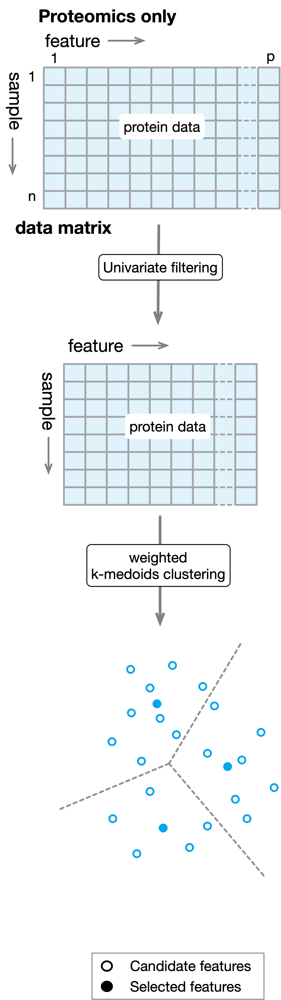

Introduction
============

Although intially designed for selecting protein markers, `ProMS` can be
used for selecting discriminative features in any target view with or without 
the information from auxiliary views. Target
variable can be binary (classification), continuous (regression) or 
censored survival data (survival analysis). 
In the following, we will use 
protein marker selection for classification as an example to describe the algorithms.

We provide two methods for selecting protein markers.

ProMS: Protein marker selection with proteomics data alone
----------------------------------------------------------
The algorithm `ProMS` works as follows. As a first
step to remove uninformative features, `ProMS` examines each feature 
individually to determine the strength of the relationship between the feature 
and the target variable. For classification problem, a symmetric AUROC score 
:math:`AUC_{sym}` is defined to evaluate such strength: 

.. math::
  AUC_{sym} = 2 \times |AUC - 0.5|

`ProMS` only keeps the features with the top :math:`\alpha\%` highest  scores. 
Here :math:`\alpha\%` is a hyperparameter that needs to be tuned jointly with 
other hyperparameters of the final estimator. After the filtering step, 
data matrix :math:`D` is reduced to :math:`D'` of size :math:`n\times p'` where
:math:`p' \ll p`. 
To further reduce the redundancy among the remaining features, `ProMS` groups 
:math:`p'` features into :math:`k` clusters with weighted k-medoids clustering
in sample space. The :math:`k` medoids from each cluster are selected as markers.
The whole process is illustrated in the following diagram:

ProMS_mo: Protein marker selection with multi-omics data
--------------------------------------------------------
We have :math:`H` data sources, :math:`D_1, D_2, ..., D_H` , 
representing :math:`H` different types of omics measurements that
jointly depicts the same set of samples :math:`s_1, s_2, ..., s_n`.
:math:`D_i (i=1,...,H)` is a matrix of size :math:`n\times p_i` 
where rows correspond to samples and columns correspond to features
in :math:`i`th data source. Without the loss of generality,
we use :math:`D_1` to represent the proteomics data from which we
seek to select a set of informative markers that can be used to predict 
the target labels. Similar to `ProMS`, the first step of `ProMS_mo`
involves filtering out insignificant features from each data source separately.
Again for classification problem, we use :math:`AUC_{sym}` to 
evaluate feature significance. `ProMS_mo` first applies the univariate 
filtering to target data source and keeps only the top :math:`\alpha\%` 
features with the highest scores. We denote the minimal score 
among these remaining features as :math:`\theta`. For other data sources,
`ProMS_mo` only keeps those features with score larger than :math:`\theta`. 
Filtered data matrices are combined into a new matrix  :math:`D'` of size
:math:`n\times p'`, where :math:`p'=\sum_{i=1}^{H} p'_i` and
:math:`p'_i` is the number of features in the filtered data source :math:`i`. 
Finally, weighted k-medoids clustering is performed to partition the :math:`p'` 
features into :math:`k` clusters in sample spaces. To guarantee
that only protein markers are selected as medoids, `ProMS_mo` first selects 
:math:`k` protein markers as the initial medoids. During the iterative steps 
of optimization, a medoid can only be replaced by another protein marker
if such exchange improves the objective function.
After the iterative process converges, :math:`k` medoids are selected as 
the final protein markers to train a classifier. The steps are depicted
in the following diagram:

.. image:: images/proms_mo.png
  :align: center
  :width: 400px
